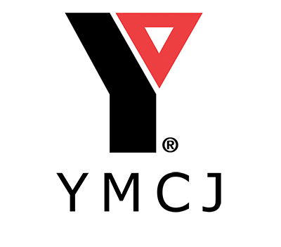

# Book Share
This full-stack application utilizes Model-View Controller (MVC) programming to allow users to share and discuss their favorite books.
## Features
- Allow a user to post, comment, and delete content on a CMS-style blog site.
- Allow a user to sign in with a username and password.
- Allow a user to sign-up with a username and password.
- Allow a user to view timestamps on a blog post.
- Allow a user to search and share books.
## Technology and Methodology
The application utilizes the model-view-controller (MVC) software architecture. It presents a user interface that sends request and solicits responses from a backend MySQL database through javascript based api controllers.
## Usage
The user can log into a CMS-style blog to perform the following actions:
- Sign-up with a new username.
- Sign-in with an existing username.
- Navigate to the home page, dashboard, and the option to log out.
- Edit an existing comment post.
- Post a new blog post.
- Delete an existing blog post.
- Comment an existing blog post.
- Create a list of books using a search function through a database.
## Installation
Install package.json dependencies.
- Run "npm i"
Connect connection.js script to your local SQL database editor.
- Modify database password line in .env file with that of your local SQL database editor.
Create database tables:
- Run schema.sql in your local SQL database editor.
- Seed SQL database editor
    - Run "node run seed"
Execute the program:
- Run "npm start"
## Application Demo Snippet

## :link: Deployed Site Link
https://bookclub-project-two.herokuapp.com/
## Tech Stack
- JavaScript
- TailwindCSS
- JQuery
- MySQL
- Node.js
    - NPM (node-fetch)
    - NPM (Express)
    - NPM (DotEnv)
    - NPM (Sequelize)
    - NPM (handlebars)
    - NPM (connect-session-sequelize)
    - NPM (mysql2)
    - NPM (bcrypt)
- ES6+ Syntax
**Server:** Visual Studio Code, Heroku
## Authors
- [@liquidmonks](https://www.github.com/liquidmonks)
- [@salamanderspeak](https://www.github.com/salamanderspeak)
- [@cadienlake](https://github.com/cadienlake)
- [yamari93](https://github.com/yamari93)

## License
[MIT](https://choosealicense.com/licenses/mit/)
